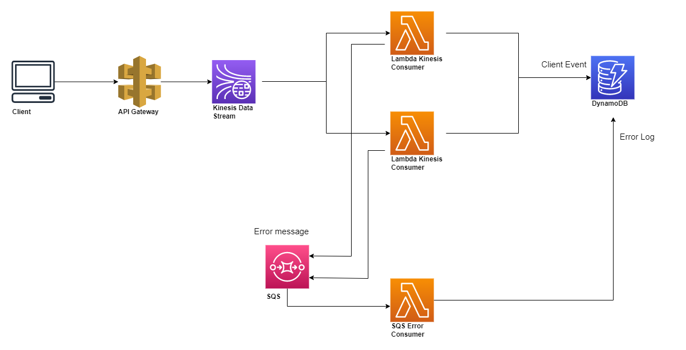

## Build lambda

#### Compile your executable.
```bash
GOOS=linux go build main.go
```
#### Create a deployment package by packaging the executable in a .zip file.
```bash
zip function.zip main
```
### Reference
[Deploy .zip file archives](https://docs.aws.amazon.com/lambda/latest/dg/golang-package.html)

## Lambda function CLI
### Create function
```bash
aws lambda create-function --function-name hello-dynamo --zip-file fileb://function.zip --handler main --runtime go1.x --role arn:aws:iam::990204874157:role/lambda-ex
```

### Configure the event source
```bash
aws lambda create-event-source-mapping --function-name sqs-error-consumer  --batch-size 10  --event-source-arn arn:aws:sqs:ap-northeast-1:990204874157:consumer-error-queue
```

### Update function
```bash
 aws lambda update-function-code --function-name  kinesis-consumer  --zip-file fileb://function.zip
```


## Managing roles with the IAM API

### Lambda role
"Arn": "arn:aws:iam::990204874157:role/lambda-ex",

### Create an execution role
```bash
aws iam create-role --role-name lambda-ex --assume-role-policy-document '{"Version": "2012-10-17","Statement": [{ "Effect": "Allow", "Principal": {"Service": "lambda.amazonaws.com"}, "Action": "sts:AssumeRole"}]}'
```

### Add permissions to the role
```bash
aws iam attach-role-policy --role-name lambda-ex --policy-arn arn:aws:iam::aws:policy/service-role/AWSLambdaBasicExecutionRole
```

## Service architecture
 

## Error encountered
> IAM role permission missing cause: AWS.SimpleQueueService.NonExistentQueue

> socket: too many open files: Error

> operation error DynamoDB: PutItem, exceeded maximum number of attempts, 3, https response error StatusCode: 400

> ProvisionedThroughputExceededException: The level of configured provisioned throughput for the table was exceeded.


